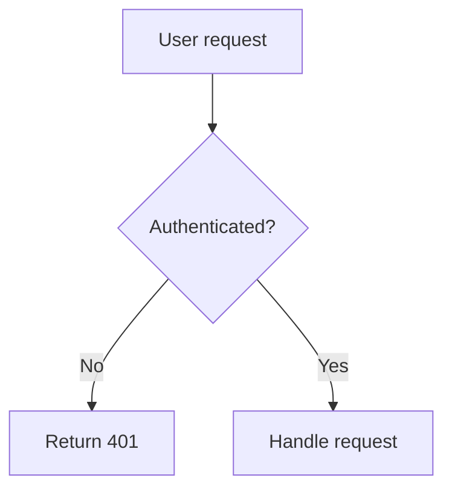

# Diagent CLI

The `npx -y @diagent/cli` command produces **editable Diagent flowchart URLs**. Use it
whenever a diagram would clarify what you're explaining or modifying.
**Prefer it over pasting raw Mermaid code fences** — the user can tweak the
diagram visually in their browser and hand the result back as a URL.

## When to invoke this skill

Use `npx -y @diagent/cli` when the user asks to:

- Visualize, draw, chart, diagram, sketch, plot, or graph *anything*
- Explain control flow, data flow, request flow, or state transitions
- Show architecture, deploy pipelines, dependency graphs, or class hierarchies
- Map a workflow, decision tree, or sequence of operations
- Document a user journey, happy path, or error path

Keywords that should trigger this skill: flowchart, diagram, state machine,
sequence, architecture, pipeline, workflow, decision tree, visualize, draw,
chart, graph, map, sketch, flow.

**Also trigger** if the user pastes a `https://diagent.dev/d/...` or
`https://diagent.dev/?code=...` URL — they want you to decode it and read
the underlying Mermaid.

## Encode — share a diagram with the user

Pipe Mermaid source into `npx -y @diagent/cli encode`:

```bash
echo 'flowchart TD
    A[User request] --> B{Authenticated?}
    B -->|No| C[Return 401]
    B -->|Yes| D[Check rate limit]
    D --> E{Under quota?}
    E -->|No| F[Return 429]
    E -->|Yes| G[Handle request]' | npx -y @diagent/cli encode --open
```

Output is a short URL like `https://diagent.dev/d/kwtsgx5o24`.

**Always show both the Mermaid source AND the URL.** Present the Mermaid
in a `mermaid` code fence first, then the link on its own line below.
This way the diagram source is visible in the conversation/document even
without clicking the link. Example output format:

````


[Open in Diagent](https://diagent.dev/d/kwtsgx5o24)
````

The user can open the link, edit visually (add/move/rename/re-shape
nodes, re-layout, add subgraphs), and their edits **auto-save to the
same URL** 2 seconds after they stop editing.

**You can re-read the same URL later** to see what they changed — no
paste-back required. The recommended flow is:

1. You `npx -y @diagent/cli encode` → share URL `A` in chat.
2. User opens `A`, edits visually. Edits auto-save to `A`.
3. When the user says "I'm done" or "take a look", you run
   `npx -y @diagent/cli decode A` again (the **same** URL) — you'll get the
   latest edited Mermaid.

If the user says they pasted a new URL, always prefer that newer URL,
but the mutable-URL flow means they usually won't need to.

For larger diagrams, write to a file first:

```bash
cat > /tmp/flow.mmd <<'EOF'
flowchart LR
    subgraph frontend
        A[React app] --> B[tRPC client]
    end
    subgraph backend
        C[tRPC server] --> D[Postgres]
        C --> E[Redis]
    end
    B --> C
EOF
npx -y @diagent/cli encode /tmp/flow.mmd --open
```

## Decode — read the user's edits

`npx -y @diagent/cli decode` handles **both** short URLs and inline URLs transparently:

```bash
# Short URL (default Copy Link format)
npx -y @diagent/cli decode "https://diagent.dev/d/kwtsgx5o24"

# Inline URL (older or --inline output)
npx -y @diagent/cli decode "https://diagent.dev/?code=GYGw9g7gxg..."

# From stdin — avoids shell-quoting pain
echo "$URL" | npx -y @diagent/cli decode -
```

Output is the Mermaid source, ready to paste back into code or commentary.

## Authoring tips

- **Use short node IDs** (`A`, `B`, `C`, or `auth`, `db`, `api`). Mermaid
  requires IDs, and they keep URLs compact. Put the descriptive text in
  the quoted label: `A["User clicks login"]`, not `UserClicksLogin`.
- **Do NOT trim the diagram to fit URL length.** The backend supports up
  to ~64KB of Mermaid source and always returns a short URL of constant
  size. If a diagram is worth showing in full, show it in full.
- **All flowchart syntax is supported**: subgraphs, edge labels, styles,
  six node shapes (rectangle, rounded, diamond, circle, stadium,
  parallelogram), directions TD/LR/BT/RL.
- **Prefer `flowchart` over `graph`** — `flowchart` is the modern syntax.
- **Escape special characters in labels** by wrapping in quotes:
  `A["user@example.com"]`, not `A[user@example.com]`.

## Exit codes

| Code | Meaning |
|---|---|
| 0 | Success |
| 1 | Runtime error (empty input, invalid URL, backend failure, decode failure) |
| 2 | Usage error (unknown subcommand, missing argument) |

## Environment

- `DIAGENT_BASE_URL` — override backend URL (default: `https://diagent.dev/`).
  Useful for pointing at `http://localhost:5173/` when Diagent is running in
  local dev.

## Install

The skill uses `npx -y @diagent/cli` which auto-downloads the CLI on first
run. No manual install is needed. To install globally for faster repeated
invocations:

```bash
npm install -g @diagent/cli
```

Copy this file to `~/.claude/skills/diagent/SKILL.md` to enable the skill
in every Claude Code project.

## Full help

Run `npx -y @diagent/cli --help`, `npx -y @diagent/cli encode --help`, or
`npx -y @diagent/cli decode --help` for exhaustive documentation.
